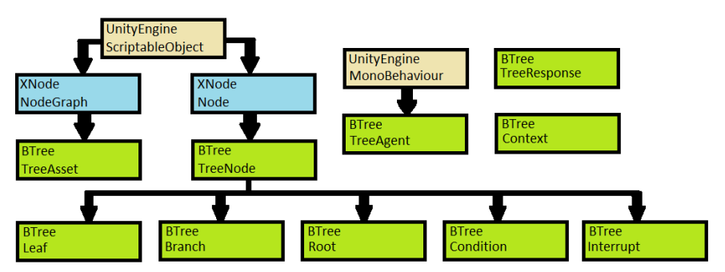
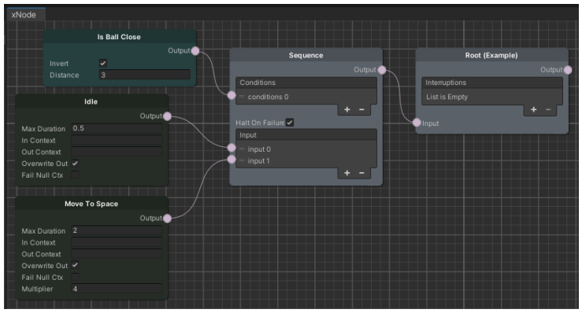
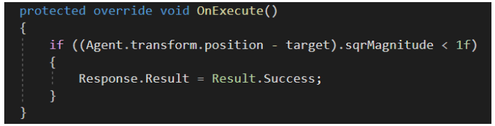
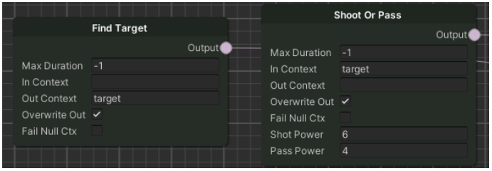

# BTree
**Behavior Tree AI editor for Unity**

This library leans heavily on an external Unity library called [XNode](https://github.com/Siccity/xNode/wiki) by Thor Brigsted. It provides the base node and 
graph classes and the editor code to represent them visually in a specialised Unity editor window. The graph and node inherit from XNode’s corresponding 
classes, allowing them to share any functionality present in the base classes. However, as noted in XNode’s documentation, its built-in functionality is 
limited to viewing and editing graphs, so the node logic and the system querying the tree is implemented with custom code.

## What is a Behaviour Tree?
The behaviour tree (also called a decision tree) can be described as a graph: a tree of hierarchical nodes that control the flow of decision making of an AI 
entity. The extents of the tree, the leaves, are the actual commands that control the AI entity, and the branches are various types of utility nodes that 
control the flow of the AI query to reach the sequences of commands best suited to the situation. The user must implement the actionable leaf nodes themselves, 
so this is NOT a visual scripting tool.

In principle the AI entity sends a query from the root up the tree. When the query reaches an actionable leaf node, it returns one of three options: Success, 
Failure, or Running. If the leaf is running (its action is being executed), the entity will stay in that state. When the node returns a success or a failure, 
another query is sent to find the next “running” result. The branch nodes along the path can modify this result according to their own rules before sending it 
on. For a leaf node to be reached, all the logic governing its preceding nodes must be satisfied as well. The implementation forces all nodes to inherit from 
an abstract base class TreeNode. The tree is forced to accept only nodes that inherit TreeNode to prevent user errors.

## Library architecture

The library can be summarised in 10 base classes (further information on implementing the system can be found in 
[Implementation details](https://github.com/EppuSyyrakki/BTree#implementation-details)).

### Graph - TreeAsset
The tree itself does not require much functionality apart from initiating a query at the root of the tree and delivering the result to the agent using it. 
Storing the graph along with the nodes and their connections as a Unity asset is handled by XNode.

A simple TreeAsset represented as a graph by XNode’s editor window. Grey nodes are logic or auxiliary nodes guiding the query. Dark green nodes are Leaf 
classes, and the turquoise node is a condition attached to a logic node. Functionally this tree will make the agent roam the play area if the ball is not 
close by.

### Nodes - TreeNode
#### TreeNode
Base class that holds functionality shared between all nodes - a reference to the agent who owns the tree, a single output port to guide the query and 
finding its possible children. The particulars of handling the delivery of the query result is left to each node type, depending on their function.

#### Leaf
An actionable node - an object that can be hotswapped to the agent. Any node inheriting from it holds practical code for an agent to interact with the world, 
or some other way for the agent to act. Any branch of logic should always end in a Leaf.

#### Branch
Reserved for nodes that handle the tree logic, such as sequence or selector. Any Branch can have Conditions attached. Users can implement their own Branch 
nodes, but the functionality present in the included Branch nodes can already cover a wide range of cases.

#### Condition
Signifies a boolean operation that is run on every frame. If it fails, the branch it is attached to fails as well. Conditions can also be used as Leaf nodes - 
in this case they are checked only when that Leaf is checked instead of being checked continually while another Leaf is being executed.

#### Root
The starting place for every query, and the only node the TreeAsset has a direct reference to. A tree both requires one of, and has no more than one Root in 
them.

#### Interrupt
A special type. It can’t be reached through the tree’s normal query, but can be forced to launch from outside the tree. In the example project, receiving a 
pass is handled with an interrupt: The agent passing the ball triggers an interrupt on the agent chosen to receive the pass. The ability to stop execution 
and jump to a different Leaf enables a significant part of event-driven behaviour trees’ functionality.

### Agent - TreeAgent
The TreeAgent class functions as an interface between the tree and Unity. It handles selecting and storing the tree and a reference to the current actionable 
leaf, timing the queries to the tree, and changing the leaf to a new one returned by the query when needed. It inherits from MonoBehaviour, so it can 
be added to a Unity GameObject as a component. Most functionality is extendable as virtual methods, making it possible to inherit from and customise the 
agent. The example project does this with the Player class.

As a ScriptableObject the tree is a shared entity, it needs to be copied to a run-time instance when the game is played, or any changes made to the graph are 
permanent and will affect all agents using it. In the implementation, this copying is the responsibility of the agent. To avoid null reference errors in the 
execution where some object doesn’t exist as it’s being accessed, evaluating the tree and changing to a new Leaf is done within the same call stack of 
methods - i.e. immediately. This ensures that the reference to the current Leaf is never null at runtime.

### TreeResponse
The TreeResponse class is a wrapper object that is returned to the agent when the tree is evaluated. Its creation is the responsibility of the Leaf class, as the 
query ultimately reaches one through the logic branches. It holds a reference to the Leaf that created it, a Result enumeration (with possible values Running, 
Success and Failure), and references to any Condition nodes it encountered in the branches en route to the Root. The agent then uses this response to first 
check if any of the Conditions fail, and then to execute code in the origin Leaf.

### Context
Context acts as a blackboard in the system. As a class it’s very simple, holding key/value pairs of identifiers and objects. Agents have a personal instance of 
the Context object. It is filled by implementing Leaf nodes that in an unspecified way find an object in the world, store it in the **Context property** of a 
Leaf and use their **Out Context** field on the node to specify an identifier for it. Any following Leafs can then access a stored Context object by specifying 
the same **In Context** identifier.

The Context is a class and not a simple dictionary to enable instances of it to be created outside the TreeAgent class. It is up to the user how to access and 
modify these instances. Another benefit of implementing it as a class is that it can handle destroyed contexts better. If a context object is destroyed or 
removed from the game world, it must also be removed from the context dictionary.

## Implementation details
In practice the system is an amalgamation of a state machine and a behaviour tree. The Leaf classes are the states, only one of which can be active at any 
time, but their organisation and fetching is handled with a tree (graph) structure instead of transitions from state to state.

The user is responsible for programming the states themselves by inheriting from the Leaf class and filling the required methods. The agent only drives an 
abstracted interface that the Leaf class implements, and calls three methods on it: Enter, Execute and Exit, which run code common to all Leaf nodes, such as 
fetching or resetting a context in Enter and Exit respectively. Those methods in turn call their counterparts in the inheritor with an _On_ prefix. As such, 
any class inheriting from Leaf must implement the methods _OnEnter_, _OnExecute_ and _OnExit_, among a few other utility methods that correspond to special 
situations such as initialization or forced failure.

As with any Unity object, Leaf classes can use editor-assignable variables by using the SerializeField attribute. XNode restricts these variables to be either 
prefabs or value types, as a Scriptable Object such as the TreeAsset or TreeNode classes cannot reference scene objects.

The documentation within the scripts can provide further information on their usage and implementation that might not be expressed here.

### Implementing the Leaf class
OnEnter, OnExit and OnExecute can be called on the same frame in different nodes. The Result of a node is checked immediately after calling the Execute 
method on it. When that result is detected as not Running, OnExit is immediately called on that Leaf. The tree is then evaluated, and OnEnter is called on 
the resulting new Leaf. In the next frame, this new Leaf’s OnExecute method is called and the Result checked again.

#### OnEnter
Called when an agent receives a new Leaf from the tree. It can handle setting up variables for the OnExecute method or other initialization specific to 
this particular execution of this node (as opposed to OnInitialize that is called only once at startup). At this point any possible Context object is already 
fetched from the agent by the base Leaf class.

#### OnExecute 
Drives the performance of an action. It is called on every frame by the agent, and might contain a code block that handles setting the Result. For example, 
it could be set to Success on a _Move To_ node if the agent is close to whichever target it was assigned. If a _Max Duration_ field is set on the node, the 
base class will advance a timer and check if that duration is exceeded and fail the node, but only if the result is still marked as Running. This enables 
inheritor classes to use the Max Duration field with their own timer to set a success result - the default implementation sets the Result as Failure if Max 
Duration is exceeded.

#### OnExit 
Called when the execution of a node ends. It can be used to reset any variables that were altered during the execution of this node, such as 
custom timers. The base class will handle resetting any possible context used.

#### Setting the Result property
Changes to the result of a node are done through a property of the TreeResponse class named Response, which in turn has a property of a Result 
enumerator with the possible values of Running, Success and Failure, as described previously.

A code example of setting the result of a node inside the OnExecute method. The _target_ variable was assigned, and the movement initiated inside this node’s 
OnEnter method.

### Creating a TreeAsset
The TreeAsset is the template of the tree used by a TreeAgent, copied automatically to an instanced version at runtime. Users can create new TreeAssets from 
Unity’s project window via the Create menu. Cloning existing trees is handled like any other asset cloning inside Unity. Once a TreeAsset is created, it can be 
edited in XNode’s editor window by opening the asset. In the editor window, new nodes can be added via right clicking the window. Connections between nodes 
can be added by dragging from any **Output port** to another **Input port**. All paths of connections should eventually lead to the Root node.

### Node logic flow
The user is responsible for ensuring a tree’s logic flow is viable for execution. This requires understanding the functions of the Branch nodes.

#### Condition
A true/false condition that can be connected to either the Condition connectors on Branch nodes, or as a Leaf at the end of a logic path. In either case, 
an abstract method must be implemented to perform that check. The implementation has a single built-in condition called HasContext that compares a text field 
and returns a success or true result if an object with that name exists within the agent’s context.

#### Interrupt
Can be called from outside the agent with the provided identification field. Once called, any Interrupt will start executing the logic attached to it until no 
more Running results are found from its children, at which point the tree will return to normal execution - either continuing from where it left off or 
resetting the tree entirely, depending on the **Force Reset** field on the node.

#### Inverter
The simplest logic node, turning a Success result into a Failure and vice versa. It will not affect any Running result.

#### Repeater
Resets its children and restarts their execution on receiving a Success a set amount of times or indefinitely. It can be modified to act in the same way 
in the case of a Failure result by setting the **Ignore Failures** field on the node.

#### Selector
Chooses a single child node that is able to run and passes on the result received from it. If no children are able to run, or the chosen child returns a 
Failure, it will return a Failure upwards.

#### Sequence
Tries to run each of its children, moving to the next child if the previous returned a Success. A Failure result can be configured to halt execution and 
pass the result on, or simply alter that result to Running and move on to the next child by setting the **Halt On Failure** field on the node.

#### Selector and Sequence child priority
**Selector** and **Sequence** are both priority-enabled nodes. This means they will start examining their children in order from top to bottom, enabling a 
user to prioritise some actions over others if conditions remain the same.

#### Sub Tree
A convenience node that represents another TreeAsset. The node will in practical terms act as another tree’s Root node. This feature can be used to recycle 
behaviours and to reduce the visual complexity of any tree.

### Using a Context
A Context container is used in the TreeAgent to store the internal context objects of that tree. The container is cleared every time the tree is reset.
Leaf is a generic class that can take the type of the context object it uses as the generic type. Any class intended for use as a context object must implement 
ITreeContext interface, but the ITreeContext interface can also be used as the generic type for the Leaf class if the user does not want to specify a type. The 
interface is very simple, requiring only a GameObject property named gameObject, so it will work without further setup on any MonoBehaviour script.

To add a context object to a tree, the user must implement a Leaf node that in an unspecified way finds the context object from the game world, and assigns it 
to the Context property of the Leaf class. When the node is exited, the base class adds that object to the agent’s Context container with the identifier 
provided on the Out Context field in the node. An example of this functionality is provided in the example’s **Find Target** node.

Two nodes in the example project utilising the Context fields. The left node sets a context with the identifier “target”, and the right node uses that context.

Once a context object has been added, it can be used in other nodes later in the execution order by specifying the same identifier to the In Context field on 
the node. The Leaf class will try to fetch the object from the Context container, and set it to the Context property of the class before calling OnEnter on the 
node. While the user must take care in creating logically sound trees, the context system has a built in safety feature that Resets the tree when an agent 
tries to use a context object that is null. This feature works through a special Exception case and its handling within a Try/Catch block.
